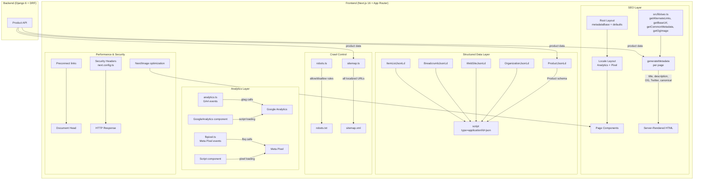

# Design Document: SEO Full Optimization

## Overview

This design covers a comprehensive SEO optimization implementation for the Artesena e-commerce platform — a Next.js 16 + Django 6 application selling handcrafted Bolivian artisan instruments (charangos, ronrocos, walaychos) across three locales (en, es, fr) with localized URL pathnames.

The optimization addresses 15 requirement areas spanning metadata, structured data, sitemaps, robots configuration, analytics, performance, accessibility, and security headers. The implementation builds on the existing `next-intl` routing, `getAlternateLinks` utility, and partial metadata generation already in place.

### Key Design Decisions

| Decision | Choice | Rationale |
|----------|--------|-----------|
| Metadata approach | `generateMetadata` per page | Already in use; server-rendered for crawler compatibility |
| JSON-LD rendering | Server components with `<script type="application/ld+json">` | Crawlers need server-rendered structured data; no JS execution |
| Analytics loading | `@next/third-parties/google` + inline Script | Already integrated; follows Next.js best practices for third-party scripts |
| OG image fallback | Static default brand image at `/img/og-default.jpg` | Ensures all pages have a shareable image even without product images |
| Security headers | `next.config.ts` `headers()` function | Applies to all routes without middleware overhead |
| Sitemap generation | Dynamic `sitemap.ts` with API fetch | Already implemented; needs priority/changefreq/exclusion enhancements |
| Breadcrumbs | Server component rendering `<ol>` + JSON-LD | SEO-friendly semantic HTML with structured data |
| CSP policy | Report-only initially, then enforce | Avoids breaking analytics scripts during rollout |

## Architecture



## Components and Interfaces

### 1. Root Layout Metadata (`src/app/layout.tsx`)

Updates the root layout to set proper default metadata and `metadataBase`.

```typescript
// src/app/layout.tsx - metadata export
import type { Metadata } from "next";

export const metadata: Metadata = {
  metadataBase: new URL(process.env.NEXT_PUBLIC_BASE_URL || "https://artesena.com"),
  title: {
    default: "Artesena | Handcrafted Bolivian Instruments",
    template: "%s | Artesena",
  },
  description: "Discover authentic handcrafted Bolivian string instruments — charangos, ronrocos, and walaychos — made by master artisans using traditional techniques passed down through generations.",
  openGraph: {
    siteName: "Artesena",
  },
};
```

### 2. Enhanced SEO Utilities (`src/lib/seo.ts`)

Extends the existing SEO library with OG image helpers and metadata builders.

```typescript
// Additional exports in src/lib/seo.ts

export interface OgImageConfig {
  url: string;
  width: number;
  height: number;
  alt: string;
}

/**
 * Returns the default OG image configuration for pages without specific images.
 */
export function getDefaultOgImage(): OgImageConfig {
  const baseUrl = getBaseUrl();
  return {
    url: `${baseUrl}/img/og-default.jpg`,
    width: 1200,
    height: 630,
    alt: "Artesena - Handcrafted Bolivian Instruments",
  };
}

/**
 * Returns the OG image config for a product, falling back to default.
 */
export function getProductOgImage(
  images: Array<{ image: string }> | undefined,
  productName: string
): OgImageConfig {
  const baseUrl = getBaseUrl();
  if (images && images.length > 0) {
    const imageUrl = images[0].image.startsWith("http")
      ? images[0].image
      : `${baseUrl}${images[0].image}`;
    return {
      url: imageUrl,
      width: 1200,
      height: 630,
      alt: productName,
    };
  }
  return getDefaultOgImage();
}

/**
 * Truncates text to a maximum length with ellipsis.
 */
export function truncate(text: string, maxLength: number): string {
  if (!text) return "";
  if (text.length <= maxLength) return text;
  return text.slice(0, maxLength - 3) + "...";
}
```

### 3. JSON-LD Components (`src/components/seo/`)

#### ProductJsonLd (Enhanced)

```typescript
// src/components/seo/ProductJsonLd.tsx
interface ProductJsonLdProps {
  name: string;
  description: string;
  base_price: number | string;
  images?: Array<{ image: string }>;
  sku?: string;
  category?: string;
}
```

#### OrganizationJsonLd (New)

```typescript
// src/components/seo/OrganizationJsonLd.tsx
interface OrganizationJsonLdProps {
  baseUrl: string;
}

// Outputs Schema.org Organization with:
// name, url, logo, contactPoint (email, phone), sameAs (social links)
```

#### WebSiteJsonLd (New)

```typescript
// src/components/seo/WebSiteJsonLd.tsx
interface WebSiteJsonLdProps {
  baseUrl: string;
  locale: string;
}

// Outputs Schema.org WebSite with:
// name, url, potentialAction: SearchAction targeting /[locale]/products?q={search_term}
```

#### BreadcrumbJsonLd (New)

```typescript
// src/components/seo/BreadcrumbJsonLd.tsx
interface BreadcrumbItem {
  name: string;
  url: string;
}

interface BreadcrumbJsonLdProps {
  items: BreadcrumbItem[];
}

// Outputs Schema.org BreadcrumbList with itemListElement array
```

#### ItemListJsonLd (New)

```typescript
// src/components/seo/ItemListJsonLd.tsx
interface ItemListProduct {
  id: number;
  name: string;
  url: string;
}

interface ItemListJsonLdProps {
  products: ItemListProduct[];
}

// Outputs Schema.org ItemList with ListItem entries for each product
```

### 4. Breadcrumb Navigation Component (New)

```typescript
// src/components/seo/Breadcrumb.tsx
interface BreadcrumbProps {
  items: Array<{ label: string; href: string }>;
  locale: string;
}

// Renders semantic <nav aria-label="Breadcrumb"><ol>...</ol></nav>
// Each item is an <li> with a Link component using localized paths
```

### 5. Enhanced Sitemap (`src/app/sitemap.ts`)

Adds priority, changefreq, and excludes non-indexable pages.

```typescript
// Priority and changefreq configuration
const PAGE_CONFIG: Record<string, { priority: number; changefreq: string }> = {
  "/": { priority: 1.0, changefreq: "weekly" },
  "/products": { priority: 0.8, changefreq: "daily" },
  "/products/[id]": { priority: 0.7, changefreq: "daily" },
  "/about": { priority: 0.6, changefreq: "monthly" },
  "/contact": { priority: 0.6, changefreq: "monthly" },
};

// STATIC_PAGES excludes /cart and /checkout (non-indexable)
const STATIC_PAGES: Array<keyof typeof routing.pathnames> = [
  "/",
  "/products",
  "/about",
  "/contact",
];
```

### 6. Enhanced Robots Configuration (`src/app/robots.ts`)

```typescript
// Updated robots.ts
export default function robots(): MetadataRoute.Robots {
  return {
    rules: [
      {
        userAgent: "*",
        allow: "/",
        disallow: ["/api/", "/admin/", "/media/", "/cart", "/checkout", "/_next/"],
      },
    ],
    sitemap: `${getBaseUrl()}/sitemap.xml`,
  };
}
```

### 7. Security Headers (`next.config.ts`)

```typescript
// Added to next.config.ts
async headers() {
  return [
    {
      source: "/(.*)",
      headers: [
        { key: "X-Content-Type-Options", value: "nosniff" },
        { key: "Referrer-Policy", value: "strict-origin-when-cross-origin" },
        { key: "X-Frame-Options", value: "DENY" },
        {
          key: "Content-Security-Policy",
          value: [
            "default-src 'self'",
            "script-src 'self' 'unsafe-inline' 'unsafe-eval' https://www.googletagmanager.com https://www.google-analytics.com https://connect.facebook.net",
            "style-src 'self' 'unsafe-inline' https://fonts.googleapis.com",
            "img-src 'self' data: https: http://127.0.0.1:8000",
            "font-src 'self' https://fonts.gstatic.com",
            "connect-src 'self' https://www.google-analytics.com https://www.facebook.com http://127.0.0.1:8000 https://artesena.com",
          ].join("; "),
        },
      ],
    },
  ];
},
```

### 8. Analytics Event Functions (Enhanced)

The existing `analytics.ts` and `fbpixel.ts` already implement the required events. The enhancement adds guard checks for empty environment variables:

```typescript
// analytics.ts - enhanced guard
export const GA_ID = process.env.NEXT_PUBLIC_GA_ID;

function isGaEnabled(): boolean {
  return Boolean(GA_ID) && typeof window !== "undefined" && typeof window.gtag !== "undefined";
}

export const gaPageview = (url: string) => {
  if (!isGaEnabled()) return;
  window.gtag("config", GA_ID, { page_path: url });
};
```

```typescript
// fbpixel.ts - enhanced guard
export const FB_PIXEL_ID = process.env.NEXT_PUBLIC_FB_PIXEL_ID;

function isFbEnabled(): boolean {
  return Boolean(FB_PIXEL_ID) && typeof window !== "undefined" && typeof window.fbq !== "undefined";
}

export const fbPageview = () => {
  if (!isFbEnabled()) return;
  window.fbq("track", "PageView");
};
```

### 9. Locale Layout Analytics Conditional Rendering

```typescript
// src/app/[locale]/layout.tsx - conditional rendering
{GA_ID && <GoogleAnalytics gaId={GA_ID} />}

{FB_PIXEL_ID && (
  <>
    <Script id="fb-pixel" strategy="afterInteractive" ... />
    <noscript>
      
    </noscript>
  </>
)}
```

### 10. Preconnect Links (Root Layout Head)

```typescript
// src/app/layout.tsx - head section
<head>
  <link rel="preconnect" href="https://fonts.googleapis.com" />
  <link rel="preconnect" href="https://fonts.gstatic.com" crossOrigin="anonymous" />
  <link rel="preconnect" href="https://www.googletagmanager.com" />
  <link rel="preconnect" href="https://www.google-analytics.com" />
  <link rel="preconnect" href="https://connect.facebook.net" />
  {process.env.NEXT_PUBLIC_API_URL && (
    <link rel="preconnect" href={process.env.NEXT_PUBLIC_API_URL} />
  )}
</head>
```

## Data Models

### Existing Models (No Changes Required)

The backend models already support all required data:

- **Product** — `id`, `name`, `description`, `base_price`, `category`, `sku`, `images`
- **ProductTranslation** — per-locale `name`, `description`
- **ProductImage** — `product`, `image` (file path)
- **Category** / **CategoryTranslation** — category names per locale

### Frontend Data Interfaces

```typescript
// Product data from API (used by metadata generators and JSON-LD)
interface ApiProduct {
  id: number;
  name: string;
  description: string;
  base_price: string | number;
  category_name?: string;
  sku?: string;
  images: Array<{ id: number; image: string }>;
  updated_at?: string;
}

// Cart data (used by analytics events)
interface CartData {
  total: number;
  items: Array<{
    product_id: number;
    product_name: string;
    product_price: string | number;
    quantity: number;
  }>;
}

// Order data (used by purchase events)
interface OrderData {
  id: number;
  total_price: string | number;
  items: Array<{
    product_id: number;
    product_name: string;
    product_price: string | number;
    quantity: number;
  }>;
}
```

### Sitemap Entry Configuration

```typescript
interface SitemapPageConfig {
  priority: number;
  changefreq: "daily" | "weekly" | "monthly" | "yearly";
}

// Page type to config mapping
const PAGE_CONFIG: Record<string, SitemapPageConfig> = {
  "/": { priority: 1.0, changefreq: "weekly" },
  "/products": { priority: 0.8, changefreq: "daily" },
  "/products/[id]": { priority: 0.7, changefreq: "daily" },
  "/about": { priority: 0.6, changefreq: "monthly" },
  "/contact": { priority: 0.6, changefreq: "monthly" },
};
```

## Correctness Properties

*A property is a characteristic or behavior that should hold true across all valid executions of a system — essentially, a formal statement about what the system should do. Properties serve as the bridge between human-readable specifications and machine-verifiable correctness guarantees.*

### Property 1: Canonical URL and hreflang correctness

*For any* valid route key (from the routing pathnames config), any supported locale, and any valid route params, `getAlternateLinks` shall produce: (a) a canonical URL that starts with the base URL, contains the locale prefix, and uses the localized pathname for that locale; (b) hreflang entries for all three locales (en_US, es_ES, fr_FR) with correctly localized URLs; and (c) an x-default entry pointing to the English locale version.

**Validates: Requirements 3.1, 3.2, 3.3**

### Property 2: Metadata description length constraint

*For any* indexable page with valid content (product name/description or translation keys), the generated `description` meta tag shall have a length between 50 and 160 characters inclusive.

**Validates: Requirements 2.2**

### Property 3: Complete OG metadata for indexable pages

*For any* indexable page (Home, Products List, Product Detail, About, Contact) with valid content and any supported locale, the generated metadata shall include: `og:title` (non-empty), `og:description` (non-empty), `og:image` with width ≥ 1200 and height ≥ 630 and non-empty alt text, `og:url` (matching canonical), `og:type`, `og:locale` (BCP 47 format), and `og:site_name` equal to "Artesena".

**Validates: Requirements 2.3, 2.6, 9.1, 9.4**

### Property 4: Twitter Card metadata completeness

*For any* indexable page with valid content and any supported locale, the generated metadata shall include `twitter:card` set to "summary_large_image", `twitter:title` (non-empty), `twitter:description` (non-empty), and `twitter:image` (valid URL).

**Validates: Requirements 2.4, 13.1**

### Property 5: OG locale metadata correctness

*For any* supported locale as the current page locale, the metadata shall include `og:locale` with the BCP 47 value for that locale (en→en_US, es→es_ES, fr→fr_FR), and `og:locale:alternate` containing the BCP 47 values for the other two supported locales.

**Validates: Requirements 13.4, 13.5**

### Property 6: OG type varies by page type

*For any* static page (Home, Products List, About, Contact), `og:type` shall be "website". *For any* Product Detail page, `og:type` shall be "product".

**Validates: Requirements 13.3**

### Property 7: Product OG image selection

*For any* product with a non-empty images array, the `og:image` URL shall match the first image in the array (resolved to absolute URL). *For any* product with an empty or missing images array, the `og:image` shall use the default brand image URL.

**Validates: Requirements 9.2, 9.3**

### Property 8: Product JSON-LD completeness

*For any* valid product (with name, description, base_price, and images), the JSON-LD output shall be a valid Schema.org Product object containing: `@type: "Product"`, `name`, `description`, `brand` (with name "Artesena"), `offers` (with price, priceCurrency "USD", availability "InStock"), and `image` (when images exist). If the product has a category, the JSON-LD shall include the `category` field; if no category, it shall be absent.

**Validates: Requirements 4.1, 4.6**

### Property 9: BreadcrumbList JSON-LD correctness

*For any* Product Detail page with a valid product name and locale, the BreadcrumbList JSON-LD shall contain an ordered `itemListElement` array with items representing: Home (position 1, localized URL), Products (position 2, localized URL), and the product name (position 3, localized URL). All URLs shall use the correct localized pathnames for the given locale.

**Validates: Requirements 4.4**

### Property 10: ItemList JSON-LD correctness

*For any* non-empty list of products on the Products List page, the ItemList JSON-LD shall contain a `itemListElement` array with one `ListItem` entry per product, each having a `position` (1-indexed), `name`, and `url` matching the product's localized detail page URL.

**Validates: Requirements 4.5**

### Property 11: Sitemap product entries with localized URLs and alternates

*For any* active product and any supported locale, the sitemap shall contain an entry whose URL uses the localized pathname for that locale (e.g., `/es/productos/1` not `/es/products/1`), and whose `alternates.languages` object contains entries for all three locales with their respective localized URLs.

**Validates: Requirements 5.2, 5.6, 5.7**

### Property 12: GA e-commerce event correctness

*For any* valid product object (with id, name, category_name, base_price), the `gaViewItem` function shall call `gtag('event', 'view_item', ...)` with an items array containing `item_id`, `item_name`, `item_category`, and `price`. *For any* valid product, quantity (1-99), and total, `gaAddToCart` shall include the quantity in the items array and the total as value. *For any* valid cart with items, `gaBeginCheckout` shall map all items. *For any* valid order, `gaPurchase` shall include `transaction_id`, `value`, `currency`, and all items. *For any* valid product array, `gaViewItemList` shall include all products with index positions.

**Validates: Requirements 7.3, 7.4, 7.5, 7.6, 7.7**

### Property 13: FB Pixel e-commerce event correctness

*For any* valid product object, `fbViewContent` shall call `fbq('track', 'ViewContent', ...)` with `content_ids`, `content_name`, `value`, and `currency`. *For any* valid product, quantity, and total, `fbAddToCart` shall include all fields. *For any* valid cart, `fbInitiateCheckout` shall include `value` and `num_items`. *For any* valid order, `fbPurchase` shall include `value` and `content_ids`.

**Validates: Requirements 8.2, 8.3, 8.4, 8.5**

### Property 14: Internal links use localized pathnames

*For any* supported locale and any navigation link rendered by the Navbar component, the link's href shall contain the current locale prefix and use the localized pathname from the routing configuration for that locale.

**Validates: Requirements 14.2**

### Property 15: HTML lang attribute matches locale

*For any* supported locale used as the current page locale, the rendered `<html>` element shall have a `lang` attribute whose value equals that locale string.

**Validates: Requirements 12.5**

### Property 16: Image alt attributes are descriptive

*For any* product with images rendered on a Product Detail page, each `` element shall have a non-empty `alt` attribute derived from the product name or image description.

**Validates: Requirements 12.3**

## Error Handling

| Scenario | Handling Strategy |
|----------|-------------------|
| Product API returns 404 (product not found) | `generateMetadata` returns `robots: { index: false }`, omits canonical/hreflang, shows "Product not found" title |
| Product API network failure | `fetchProduct` returns null, page shows error state, metadata uses fallback title |
| Missing OG image (product has no images) | Falls back to default brand image `/img/og-default.jpg` |
| Invalid locale in URL | Locale layout redirects to default locale `/en` |
| GA_ID environment variable empty | `GoogleAnalytics` component not rendered, all `ga*` functions are no-ops |
| FB_PIXEL_ID environment variable empty | Pixel script not rendered, `noscript` fallback not rendered, all `fb*` functions are no-ops |
| Sitemap product fetch failure | `fetchProducts` returns empty array, sitemap contains only static pages |
| Translation key missing | Falls back to default locale value via `next-intl` fallback mechanism |
| CSP blocks a script | Report-only mode logs violations; fix CSP before enforcing |
| `NEXT_PUBLIC_BASE_URL` not set | Falls back to `http://localhost:3000` (development only) |
| Product has no category | JSON-LD omits `category` field; no error |
| Product has no SKU | JSON-LD omits `sku` field; no error |

## Testing Strategy

### Property-Based Testing

This feature is suitable for property-based testing because it contains multiple pure functions with universal behaviors that vary meaningfully with input: URL resolution, metadata generation, JSON-LD construction, analytics event formatting, and sitemap building.

**Library**: [fast-check](https://github.com/dubzzz/fast-check) (already installed in devDependencies)
**Test Runner**: [vitest](https://vitest.dev/) (already configured)
**Configuration**: Minimum 100 iterations per property test
**Tag format**: `Feature: seo-full-optimization, Property {number}: {title}`

**Properties to implement as PBT:**

| Property | Module Under Test | Key Generators |
|----------|-------------------|----------------|
| 1: Canonical URL and hreflang | `src/lib/seo.ts` | Route keys, locales, route params |
| 2: Description length constraint | `generateMetadata` functions | Product names/descriptions of varying lengths |
| 3: Complete OG metadata | `generateMetadata` functions | Products with/without images, all locales |
| 4: Twitter Card completeness | `generateMetadata` functions | Products with varying data |
| 5: OG locale correctness | `getCommonMetadata` | All locale combinations |
| 6: OG type by page type | `generateMetadata` functions | Page type enum |
| 7: Product OG image selection | `getProductOgImage` | Products with 0-N images |
| 8: Product JSON-LD completeness | `ProductJsonLd` | Products with/without category, SKU, images |
| 9: BreadcrumbList correctness | `BreadcrumbJsonLd` | Product names, locales |
| 10: ItemList correctness | `ItemListJsonLd` | Product arrays of varying size |
| 11: Sitemap localized entries | `sitemap.ts` helpers | Product IDs, locales |
| 12: GA event correctness | `analytics.ts` | Products, carts, orders with varying data |
| 13: FB Pixel event correctness | `fbpixel.ts` | Products, carts, orders with varying data |
| 14: Internal links localized | Navigation utilities | Locales, route keys |
| 15: HTML lang attribute | Root layout | All locales |
| 16: Image alt attributes | `ProductJsonLd`, Image components | Products with images |

### Unit Tests (Example-Based)

- Cart page has `robots: { index: false, follow: true }` and no description (Req 2.5)
- Checkout page has `robots: { index: false }` (Req 2.5)
- Robots.txt disallows `/api/`, `/admin/`, `/media/`, `/cart`, `/checkout`, `/_next/` (Req 6.2, 6.4)
- Home page JSON-LD contains Organization schema (Req 4.2)
- Home page JSON-LD contains WebSite schema with SearchAction (Req 4.3)
- Sitemap excludes cart and checkout pages (Req 5.3)
- Sitemap sets correct priority values per page type (Req 5.4)
- Sitemap sets correct changefreq values per page type (Req 5.5)
- GA not rendered when GA_ID is empty (Req 7.8)
- FB Pixel not rendered when FB_PIXEL_ID is empty (Req 8.7)
- Navbar renders `<nav>` with `aria-label` (Req 14.1)
- Breadcrumb renders on Product and Products List pages (Req 14.3)
- Security headers include X-Content-Type-Options, Referrer-Policy, CSP (Req 15.2, 15.3, 15.4)
- next.config.ts rewrites cover all localized paths (Req 10.3)
- Root path `/` redirects to `/en` (Req 10.4)
- `twitter:site` included when TWITTER_HANDLE is configured (Req 13.2)

### Integration Tests

- Full page render produces valid HTML with single `<h1>` and sequential headings (Req 12.1, 12.2)
- All internal links resolve to valid pages (Req 14.4)
- Middleware redirects non-locale-prefixed paths correctly (Req 10.2)
- Pages served over HTTPS in production (Req 15.1)

### Performance Tests (Lighthouse CI)

- LCP < 2.5s on all pages (Req 11.1)
- CLS < 0.1 on all pages (Req 11.2)
- INP < 200ms on all pages (Req 11.3)
- Above-the-fold images use `priority` prop (Req 11.4)
- Below-the-fold images use `loading="lazy"` (Req 11.6)

### Smoke Tests

- Root layout metadata has correct title and description (Req 1.1, 1.2)
- Root layout has `metadataBase` set (Req 1.3)
- Preconnect links present in document head (Req 11.5)
- Robots.txt allows root path and references sitemap (Req 6.1, 6.3)
- `NEXT_PUBLIC_BASE_URL` uses https:// in production (Req 15.1)
