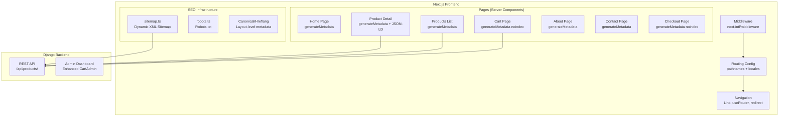

# Design Document: SEO & Localized URLs

## Overview

This design implements comprehensive SEO optimization and localized URL pathnames for the Artesena e-commerce platform. The feature spans three main areas:

1. **Localized URL Pathnames** — Translate route segments per locale using next-intl's `pathnames` configuration (e.g., `/es/productos`, `/fr/produits`)
2. **Dynamic Metadata & SEO Infrastructure** — Add `generateMetadata` to all pages, implement sitemap.xml, robots.txt, canonical URLs, hreflang alternates, and JSON-LD structured data
3. **Section-Based Home Page Routing** — Serve About and Contact as standalone pages with their own metadata that also appear as scrollable sections on the home page
4. **Cart Admin Enhancements** — Add item count, total value columns, and date filtering to the Django Cart admin

### Key Design Decisions

- **Server Component Migration**: Pages currently using `"use client"` (products list, cart, about, checkout) will be split into a server-side metadata export + a client component for interactivity. This follows Next.js App Router best practices where `generateMetadata` requires a server component.
- **next-intl pathnames**: We use `defineRouting` with the `pathnames` map to define per-locale path translations. The `createNavigation` helper automatically handles locale-aware `<Link>` and `useRouter`.
- **Base URL Configuration**: A `NEXT_PUBLIC_BASE_URL` environment variable provides the absolute URL prefix for canonical links, sitemap entries, and OG URLs.
- **Section Pages vs. Scroll Sections**: About and Contact will be separate page routes (with their own metadata) that also render as sections within the home page. When accessed directly, they render full page content. The home page includes these sections inline for scroll navigation.

## Architecture



## Components and Interfaces

### 1. Routing Configuration (`src/i18n/routing.ts`)

Updated `defineRouting` with `pathnames` map:

```typescript
import { defineRouting } from "next-intl/routing";
import { locales, defaultLocale } from "@/lib/i18n";

export const routing = defineRouting({
  locales,
  defaultLocale,
  localePrefix: "always",
  pathnames: {
    "/": "/",
    "/products": {
      en: "/products",
      es: "/productos",
      fr: "/produits",
    },
    "/products/[id]": {
      en: "/products/[id]",
      es: "/productos/[id]",
      fr: "/produits/[id]",
    },
    "/cart": {
      en: "/cart",
      es: "/carrito",
      fr: "/panier",
    },
    "/about": {
      en: "/about",
      es: "/nosotros",
      fr: "/a-propos",
    },
    "/checkout": {
      en: "/checkout",
      es: "/pagar",
      fr: "/paiement",
    },
    "/contact": {
      en: "/contact",
      es: "/contacto",
      fr: "/contact",
    },
  },
});

export type Pathnames = keyof typeof routing.pathnames;
export type AppLocale = (typeof routing.locales)[number];
```

### 2. Navigation Utilities (`src/lib/navigation.ts`)

```typescript
import { createNavigation } from "next-intl/navigation";
import { routing } from "@/i18n/routing";

export const { Link, redirect, usePathname, useRouter, getPathname } =
  createNavigation(routing);
```

### 3. SEO Utilities (`src/lib/seo.ts`)

A shared utility module for generating canonical URLs, hreflang alternates, and base metadata:

```typescript
interface AlternateLinks {
  canonical: string;
  languages: Record<string, string>;
}

function getBaseUrl(): string;
function getAlternateLinks(pathname: string, locale: string): AlternateLinks;
function getCommonMetadata(locale: string): Partial<Metadata>;
```

### 4. Sitemap Generator (`src/app/sitemap.ts`)

A Next.js metadata file that dynamically generates sitemap entries by:
- Fetching all products from the Django API
- Generating entries for all static pages × all locales with localized pathnames
- Including `xhtml:link` hreflang alternates per entry
- Setting `lastmod` from product `updated_at` timestamps

### 5. Robots.txt (`src/app/robots.ts`)

A Next.js metadata file that outputs:
- Allow all user agents on public paths
- Disallow `/api/`, `/admin/`, `/media/`
- Reference absolute sitemap URL

### 6. JSON-LD Structured Data Component (`src/components/seo/ProductJsonLd.tsx`)

A server component that renders a `<script type="application/ld+json">` tag with Schema.org Product markup on product detail pages.

### 7. Enhanced Cart Admin (`backend/apps/orders/admin.py`)

Updated `CartAdmin` with:
- `item_count` computed column (annotated queryset)
- `total_value` computed column
- `list_filter` with date range on `created_at`
- Header showing active cart count

### 8. Section-Based About/Contact Pages

About and Contact are standalone page routes under `[locale]/about/page.tsx` and `[locale]/contact/page.tsx`. They:
- Export `generateMetadata` with section-specific title/description/OG
- Render the section content as a full page
- The home page also renders these sections inline (shared components)

## Data Models

### Frontend Types

```typescript
// src/lib/seo.ts
interface SitemapEntry {
  url: string;
  lastModified: Date;
  alternates: {
    languages: Record<string, string>;
  };
}

interface ProductJsonLd {
  "@context": "https://schema.org";
  "@type": "Product";
  name: string;
  description: string;
  brand: {
    "@type": "Brand";
    name: "Artesena";
  };
  image?: string[];
  offers: {
    "@type": "Offer";
    price: string;
    priceCurrency: "USD";
    availability: "https://schema.org/InStock";
  };
}

// Routing pathnames type (auto-generated from routing config)
type AppPathnames =
  | "/"
  | "/products"
  | "/products/[id]"
  | "/cart"
  | "/about"
  | "/checkout"
  | "/contact";
```

### Backend Models (No new models needed)

The existing `Product`, `ProductTranslation`, `Cart`, `CartItem` models are sufficient. The admin enhancement uses Django's `annotate()` on the existing `Cart` queryset to compute `item_count` and `total_value` without schema changes.

### Environment Variables

| Variable | Purpose | Example |
|----------|---------|---------|
| `NEXT_PUBLIC_BASE_URL` | Absolute base URL for canonical/sitemap | `https://artesena.com` |
| `NEXT_PUBLIC_GA_ID` | Google Analytics (existing) | `G-XXXXXXX` |
| `NEXT_PUBLIC_FB_PIXEL_ID` | Facebook Pixel (existing) | `123456789` |


## Correctness Properties

*A property is a characteristic or behavior that should hold true across all valid executions of a system—essentially, a formal statement about what the system should do. Properties serve as the bridge between human-readable specifications and machine-verifiable correctness guarantees.*

### Property 1: OG Metadata Completeness

*For any* page type (home, products list, cart, about, contact, product detail) and *for any* supported locale, the generated metadata SHALL contain non-empty `og:title`, `og:description`, `og:url` (containing the locale prefix), `og:type`, and `og:locale` in valid BCP 47 format.

**Validates: Requirements 1.3, 3.3**

### Property 2: Alternate Locale Completeness

*For any* page and *for any* supported locale, the generated metadata `alternateLocale` array SHALL contain exactly the BCP 47 codes of all other supported locales (excluding the current locale), and the count SHALL equal `totalLocales - 1`.

**Validates: Requirements 1.4, 3.4**

### Property 3: Pathname Translation Preserves Structure

*For any* valid internal pathname (including those with dynamic segments like product IDs) and *for any* source/target locale pair, translating the pathname to the target locale SHALL produce a path that: (a) uses the correct localized path segment from the routing config, (b) preserves all dynamic segment values unchanged, and (c) prepends the target locale prefix.

**Validates: Requirements 4.7, 4.8**

### Property 4: Canonical URL Correctness

*For any* page pathname, *for any* locale, and *for any* set of query parameters, the generated canonical URL SHALL: (a) start with the configured base URL, (b) contain the correct locale prefix, (c) use the localized pathname, and (d) contain no query parameters.

**Validates: Requirements 9.1, 9.4, 11.1**

### Property 5: Hreflang Completeness

*For any* page pathname, the generated hreflang link set SHALL contain one entry for each supported locale (with the correct localized pathname) plus one `x-default` entry pointing to the English (default locale) version of the page.

**Validates: Requirements 9.2, 9.3, 11.2**

### Property 6: JSON-LD Product Validity

*For any* valid product data (with name, description, base_price, and optional images array), the Structured_Data_Renderer SHALL produce a JSON-LD object that: (a) has `@type` equal to "Product", (b) contains the product name and description, (c) has brand.name equal to "Artesena", (d) has an offers object with correct price, "USD" currency, and InStock availability, (e) includes an image array with all image URLs when images exist, and (f) omits the image field when no images are provided.

**Validates: Requirements 10.1, 10.2, 10.3, 10.4, 10.5, 10.6**

### Property 7: Sitemap Entry Completeness

*For any* set of products and the fixed set of static pages, the generated sitemap SHALL contain exactly `(staticPageCount + productCount) × localeCount` URL entries, where each entry uses the correct localized pathname for its locale and includes `xhtml:link` hreflang alternates pointing to the equivalent page in all other supported locales.

**Validates: Requirements 7.2, 7.3, 7.5**

### Property 8: Sitemap Lastmod Accuracy

*For any* product with a known `updated_at` timestamp, the corresponding sitemap entry's `lastModified` value SHALL equal that product's `updated_at` timestamp.

**Validates: Requirements 7.6**

### Property 9: Session ID Format Validation

*For any* string that does not match the expected session ID format pattern (`session_{timestamp}_{alphanumeric}`), the Cart Service add-item endpoint SHALL respond with HTTP 400 status and a descriptive error message.

**Validates: Requirements 6.5**

### Property 10: OG Image URLs Are Absolute

*For any* product that has at least one image, the Open Graph `images` metadata field SHALL contain URLs that start with `http://` or `https://` (absolute URLs accessible to external crawlers).

**Validates: Requirements 12.4**

## Error Handling

| Scenario | Handling Strategy |
|----------|-------------------|
| Product API unreachable during sitemap generation | Return empty product entries; log warning. Static pages still included. |
| Product not found (detail page) | Return `{ title: "Product not found", robots: { index: false } }` metadata |
| Invalid locale in URL | Middleware redirects to default locale (existing behavior) |
| Missing translation messages | Fall back to default locale messages (existing `getMessages` behavior) |
| Invalid session_id format on cart add-item | Return 400 with `{ error: "Invalid session ID format" }` |
| Missing `NEXT_PUBLIC_BASE_URL` env var | Fall back to `http://localhost:3000` in development; log warning in production |
| Product with no images (JSON-LD) | Omit `image` field entirely from structured data |
| Sitemap generation timeout | Set reasonable fetch timeout (5s); return partial sitemap with available data |

## Testing Strategy

### Unit Tests (Example-Based)

- **Routing config validation**: Verify all pathname mappings exist with correct translations (smoke tests for 4.1–4.5)
- **Robots.txt content**: Verify disallow rules and sitemap reference (8.2–8.4)
- **Cart page noindex**: Verify robots meta is "noindex, nofollow" (2.4)
- **Home page title brand**: Verify title contains "Artesena" for each locale (3.1)
- **About/Contact metadata distinction**: Verify metadata differs from home page (5.3, 5.4)
- **Twitter card**: Verify product detail includes `twitter:card: "summary_large_image"` (11.3)
- **Product not found**: Verify 404 metadata has noindex (11.4)
- **Django admin config**: Verify CartAdmin has expected list_display, list_filter, search_fields (6.1–6.3, 6.6)

### Property-Based Tests

**Library**: [fast-check](https://github.com/dubzzz/fast-check) (TypeScript PBT library)

Each property test runs a minimum of **100 iterations** with randomly generated inputs.

| Property | Generators | Assertion |
|----------|-----------|-----------|
| P1: OG Metadata Completeness | Random locale from `["en","es","fr"]`, random page type | All OG fields present and non-empty |
| P2: Alternate Locale Completeness | Random locale | alternateLocale has exactly 2 entries (other locales in BCP 47) |
| P3: Pathname Translation | Random pathname from config, random locale pair, random product ID (1–9999) | Output matches expected localized path with preserved ID |
| P4: Canonical URL Correctness | Random pathname, random locale, random query params (0–5 key-value pairs) | Absolute URL, correct locale, localized path, no query string |
| P5: Hreflang Completeness | Random pathname, random locale | 3 locale entries + 1 x-default, all with correct paths |
| P6: JSON-LD Product Validity | Random product name (1–255 chars), description (0–1000 chars), price (0.01–99999.99), images (0–10 URLs) | Valid JSON-LD with all required fields, image conditional |
| P7: Sitemap Entry Completeness | Random product list (0–50 products with IDs and timestamps) | Entry count = (static + products) × 3, each has hreflang |
| P8: Sitemap Lastmod Accuracy | Random product with random Date | lastModified matches input timestamp |
| P9: Session ID Validation | Random strings NOT matching `session_\d+_[a-z0-9]{9}` | API returns 400 |
| P10: OG Image Absolute URLs | Random product with 1–5 image paths | All OG image URLs start with http(s):// |

**Tag format**: `// Feature: seo-localized-urls, Property {N}: {title}`

### Integration Tests

- Locale switching navigates to correct translated URL
- Sitemap.xml returns valid XML with all expected entries
- About/Contact pages render section content in SSR HTML
- Cart admin displays computed columns correctly
- Product detail page includes JSON-LD script tag in rendered HTML

### Test Configuration

```json
{
  "testFramework": "vitest",
  "pbtLibrary": "fast-check",
  "minIterations": 100,
  "testLocation": "frontend/src/__tests__/seo/"
}
```
